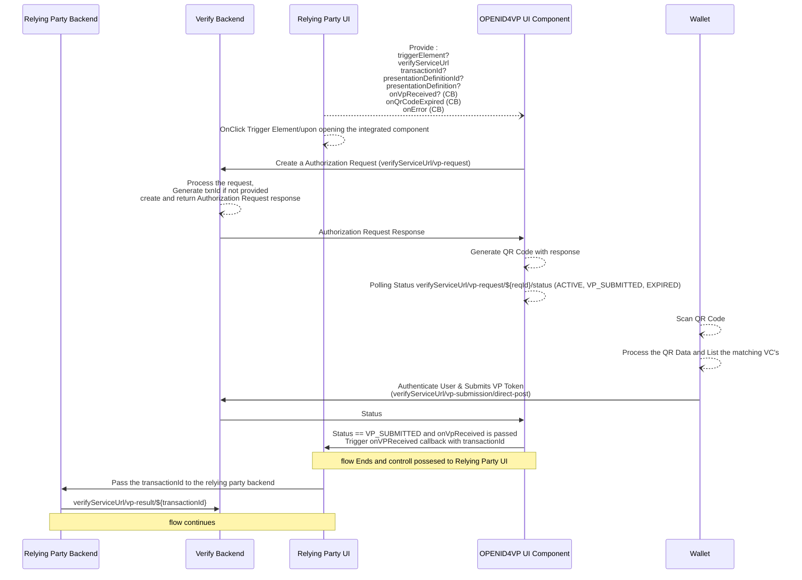
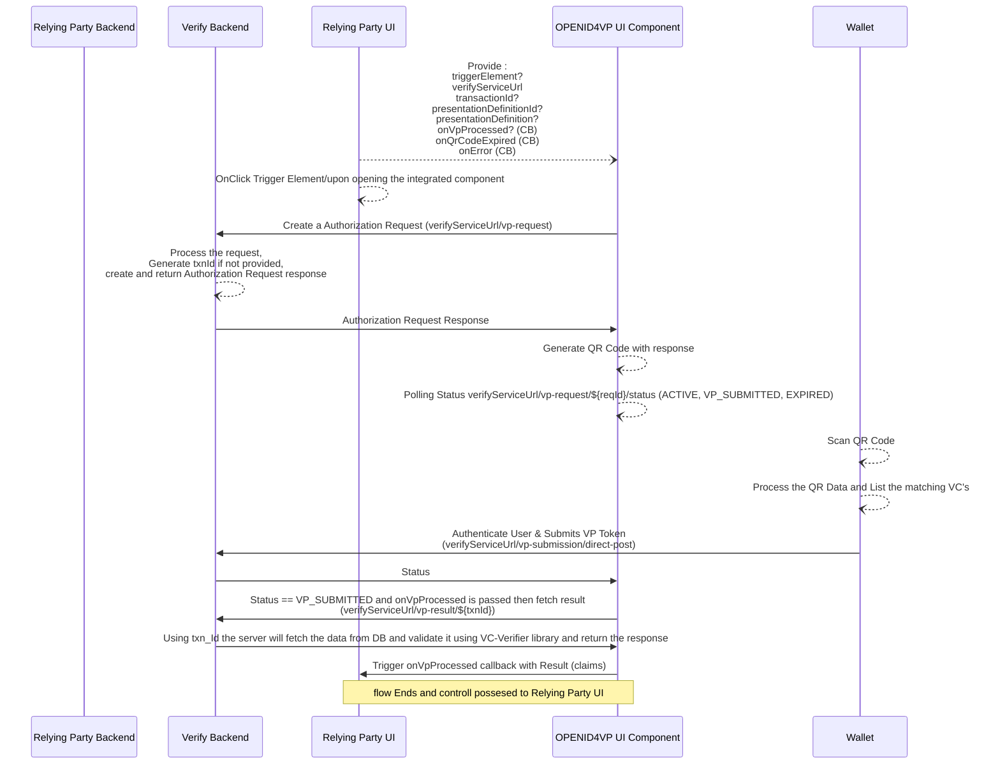
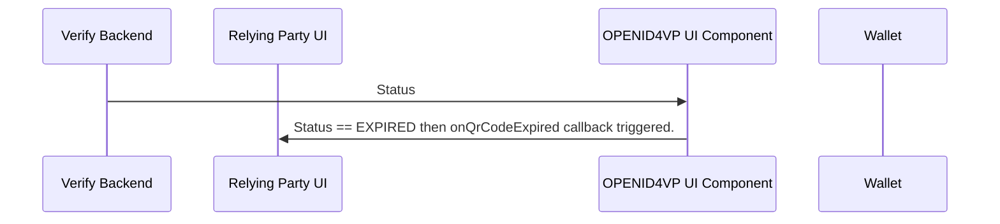
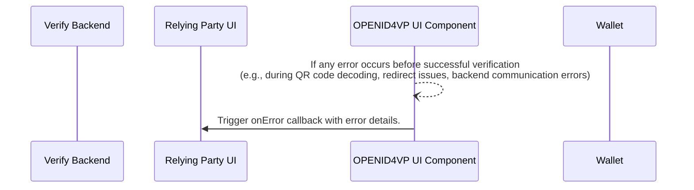

## Inji Verify SDK
The below diagram illustrates the flow in which Relying party backend is directly fetching the result from verify backend.

Relying Party UI initiates the process: The user interacts with the Relying Party's User Interface (UI) and triggers a verification action.

1. **OPENID4VP UI Component communicates with Verify Backend:** Upon the user's action, the Relying Party UI sends a request to Verify Backend. This request contains information needed to initiate the verification.

2. **Verify Backend processes the request:** The Verify Backend receives the request from the UI. It then processes this request. As part of the processing, the Verify Backend creates an Authorization Request.

3. **Verify Backend sends the Authorization Request to the OPENID4VP UI Component:** The generated Authorization Request is then sent back to the Relying Party UI ( OPENID4VP UI Component ).

4. **OPENID4VP UI Component generates a QR Code:** The component receives the Authorization Request and, based on its content, generates a QR code. This QR code will contain information that the user's wallet can scan. The generated QR code is then presented to the user through the Relying Party UI.

5. **OPENID4VP UI Component Starts Status polling a QR Code:** The component starts to poll for the current status of the Authorization request created.

6. **User scans the QR Code with their Wallet:** The user uses their digital wallet application to scan the QR code displayed by the Relying Party UI.

7. **Wallet processes the QR Code and matching VC(s):** The user's wallet application reads the data from the QR code and identifies the Verifiable Credential(s) (VCs) that are relevant to the verification request.

8. **Wallet authenticates the user and submits the VP Token:** The user authenticates themselves within their wallet application. Following authentication, the wallet constructs a Verifiable Presentation (VP) Token containing the necessary VCs and submits it to the Verify Backend (via a direct post to verifyService/vp-submission/direct-post).

9. **Verify Backend sends a Status update to the OPENID4VP UI Component:** Based on the validation result, the Verify Backend sends a status update to the OPENID4VP UI Component. This status could indicate success (VP_SUBMITTED), ongoing processing (ACTIVE), or failure (EXPIRED).

10. **Flow Ends and Control is passed to the Relying Party UI:** The core verification flow concludes, and the Relying Party UI now has the status of the verification.

11. **Relying Party UI passes the transaction result to the Relying Party Backend:** The Relying Party UI communicates the outcome of the verification (including the verifyService/vp-result and potentially the transaction details) to its backend (Relying Party Backend).

12. **Relying Party Backend acts based on the verification result:** The Relying Party Backend receives the verification result and proceeds with the next steps in its application logic based on whether the verification was successful or not.

The below diagram illustrates the flow in which Relaying party UI is directly fetching the result from verify backend.

1. **Relying Party UI initiates the process:** The user interacts with the Relying Party's User Interface (UI) and triggers a verification action.

2. **OPENID4VP UI Component communicates with Verify Backend:** Upon the user's action, the Relying Party UI sends a request to Verify Backend. This request contains information needed to initiate the verification.

3. **Verify Backend processes the request:** The Verify Backend receives the request from the UI. It then processes this request. As part of the processing, the Verify Backend creates an Authorization Request.

4. **Verify Backend sends the Authorization Request to the OPENID4VP UI Component:** The generated Authorization Request is then sent back to the Relying Party UI ( OPENID4VP UI Component ).

5. **OPENID4VP UI Component generates a QR Code:** The component receives the Authorization Request and, based on its content, generates a QR code. This QR code will contain information that the user's wallet can scan. The generated QR code is then presented to the user through the Relying Party UI.

6. **OPENID4VP UI Component Starts Status polling a QR Code:** The component starts to poll for the current status of the Authorization request created.

7. **User scans the QR Code with their Wallet:** The user uses their digital wallet application to scan the QR code displayed by the Relying Party UI.

8. **Wallet processes the QR Code and matching VC(s):** The user's wallet application reads the data from the QR code and identifies the Verifiable Credential(s) (VCs) that are relevant to the verification request.

9. **Wallet authenticates the user and submits the VP Token:** The user authenticates themselves within their wallet application. Following authentication, the wallet constructs a Verifiable Presentation (VP) Token containing the necessary VCs and submits it to the Verify Backend (via a direct post to verifyService/vp-submission/direct-post).

10. **Verify Backend sends a Status update to the OPENID4VP UI Component:** Based on the validation result, the Verify Backend sends a status update to the OPENID4VP UI Component. This status could indicate success (VP_SUBMITTED), ongoing processing (ACTIVE), or failure (EXPIRED).

11. **OPENID4VP UI Component triggers 'onProcessed' callback with the result:** When the status indicates VP_SUBMITTED and the onProcessed callback is passed, the OPENID4VP UI Component triggers this callback, providing the result of the initial submission.

12. **Relying Party UI receives the final result via the 'onProcessed' callback:** The Relying Party UI receives the final verification result through the onProcessed callback, which now includes the validated claims.

13. **Flow Ends and Control is passed to the Relying Party UI:** The complete verification flow concludes, and the Relying Party UI can now use the validated claims to proceed with the application logic.

The below diagram illustrates the flow in which an authorization request gets expired.

1. **OPENID4VP UI Component sends a Status update:** The Verify Backend sends a Status update to the OPENID4VP UI Component. At this point, the status is  something like EXPIRED or PENDING, indicating that the QR code is currently valid.

2. **Time passes and the QR code expires:** The Verify Backend sends a Status update to the OPENID4VP UI Component. At this point, the status is EXPIRED, indicating that the authorization request is currently expired.

3. **OPENID4VP UI Component triggers the onQrCodeExpired callback:** Upon detecting the expiration, the OPENID4VP UI Component triggers a callback function onQrCodeExpired .

The below diagram illustrates the flow in which an error occurs

1. **An error occurs at OPENID4VP UI Component:** An error occurs at OPENID4VP UI Component due to some response error, exceptions or expected errors.

2. **OPENID4VP UI Component triggers the onError callback:** Upon detecting the
   error, the OPENID4VP UI Component triggers a callback function onError .