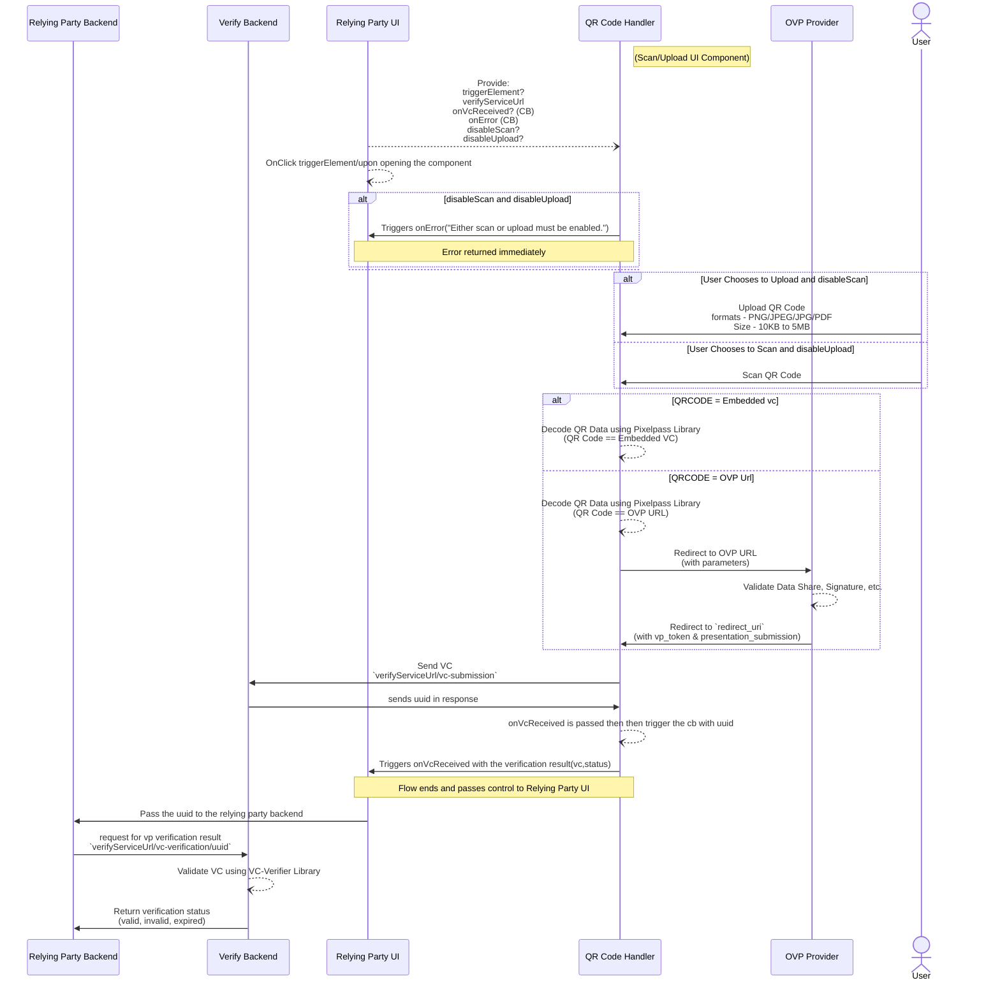
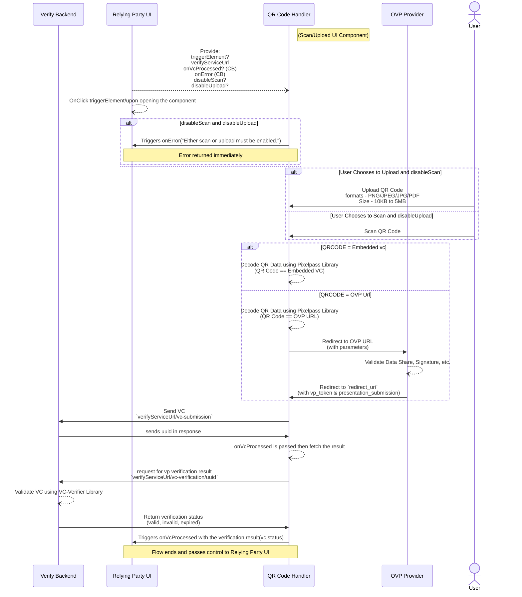
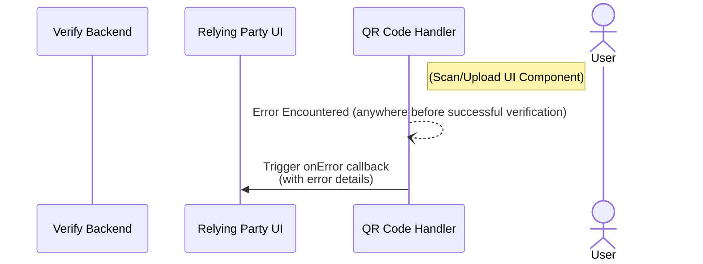

## Inji Verify SDK

### Scan/Upload Component

1. **Initial Component Trigger and State (Relying Party UI):**
   1. **Provider triggers component display:** The Relaying Party initiates the process by initializing the QRCodeVerification component. This call includes several parameters:

        `triggerElement`: The HTML element that triggers the component.

        `verifyServiceUrl`: The backend service URL.

        `onVcReceived`: A callback function for when the VC is received.

        `onError`: A callback function for error handling.
        
        `disableScan`: A boolean to disable the scan option.
        
        `disableUpload`: A boolean to disable the upload option.

   2. **On-click trigger opens component (Relying Party UI):** An `onClick` event on the `Relying Party UI` opens the component.

   3. **Initial state check (Relying Party UI):** The `Relying Party UI` checks if both `disableScan` and `disableUpload` are enabled.
2. **Handling Initial Errors (Relying Party UI):**

   1. **Error returned immediately:** If both `disableScan` and `disableUpload` are enabled (meaning neither scan nor upload is allowed), the component immediately returns an error.

3. **User Interaction and QR Code Handling (User, Relying Party UI, QR Code Handler):**

    1. **User chooses to upload and disable scan:** The `User` makes a choice within the `Relying Party UI` to upload a QR code and disables the scan option.

    2. **Upload QR code:** The `Relying Party UI` then handles the upload of the QR code, specifying accepted formats (PNG, JPEG, JPG, PDF).

    3. **User chooses to scan and disable upload:** Alternatively, the `User` can choose to scan a QR code and disable the upload option.

    4. **Scan QR Code:** The `Relying Party UI` proceeds with scanning the QR code.

    5. **QR Code Handler processes:** In both upload and scan scenarios, the `QR Code Handler` receives the QR code data.

4. **Decoding QR Code Data (QR Code Handler, OVP Provider):**

    1. **Decode QR data (Embedded VC):** If the QR code contains an embedded Verifiable Credential (VC), the `QR Code Handler` decodes the QR data using the `Pixelpass` Library. This results in an `embedded VC`.

    2. **Decode QR data (OVP URL):** If the QR code contains a URL for the OVP (Online Verifiable Presentation) provider, the `QR Code Handler` decodes the QR data using the `Pixelpass` Library to extract the `OVP URL`.

5. **Interaction with DVP Provider and Redirection (QR Code Handler, DVP Provider, Relying Party UI):**

   1. **Redirect to OVP URL:** If an `OVP URL` was obtained, the `QR Code Handler` redirects to this `OVP URL`, passing along relevant parameters.
   2. **Validate data (OVP Provider):** The `OVP Provider` validates data such as the signature.
   3. **Redirect to `redirect_url`:** The `OVP Provider` then redirects back to a `redirect_url`, including the `vp_token` and `presentation_submission`. 

6. **Verification and Submission (Relying Party UI, Verify Backend, Relying Party Backend):**

    1. **Send VC (Relying Party UI to Verify Backend):** The `Relying Party UI` sends the Verifiable Credential (VC) to the `Verify Backend` for `verifyServiceUrl/vc-submission`
    2. **Sends UUID in response (Verify Backend to Relying Party UI):** The `Verify Backend` sends a UUID back to the `Relying Party UI` in response.

    3. **Trigger `onVcReceived` (Relying Party UI):** The `onVcReceived` callback function on the `Relying Party UI` is triggered, passing the `vc_status` (verification result).

    4. **Flow ends and passes control to Relying Party UI:** The main flow concludes, and control is passed back to the `Relying Party UI`.

    5. **Pass UUID to Relying Party Backend:** The `Relying Party UI` passes the received UUID to the `Relying Party Backend`.
    6. **Request for VP verification result (Relying Party Backend to Verify Backend):** The `Relying Party Backend` requests the Verifiable Presentation (VP) verification result from the `Verify Backend` using the UUID (`verifyServiceUrl/vc-verification/{uuid}`).
    7. **Validate VC using VC Verifier Library (Verify Backend):** The `Verify Backend `validates the Verifiable Credential (VC) using a `VC Verifier Library`.
    8. **Return verification status (Verify Backend to Relying Party Backend):** Finally, the `Verify Backend` returns the verification status (e.g., valid, invalid, expired) to the `Relying Party Backend`.

1. **Initial Component Trigger and State (Relying Party UI):**
    1. **Provider triggers component display:** The Relaying Party initiates the process by initializing the QRCodeVerification component. This call includes several parameters:

       `triggerElement`: The HTML element that triggers the component.

       `verifyServiceUrl`: The backend service URL.

       `onVcProcessed`: A callback function for when the VC is received.

       `onError`: A callback function for error handling.

       `disableScan`: A boolean to disable the scan option.

       `disableUpload`: A boolean to disable the upload option.

    2. **On-click trigger opens component (Relying Party UI):** An `onClick` event on the `Relying Party UI` opens the component.

    3. **Initial state check (Relying Party UI):** The `Relying Party UI` checks if both `disableScan` and `disableUpload` are enabled.
2. **Handling Initial Errors (Relying Party UI):**

    1. **Error returned immediately:** If both `disableScan` and `disableUpload` are enabled (meaning neither scan nor upload is allowed), the component immediately returns an error.

3. **User Interaction and QR Code Handling (User, Relying Party UI, QR Code Handler):**

    1. **User chooses to upload and disable scan:** The `User` makes a choice within the `Relying Party UI` to upload a QR code and disables the scan option.

    2. **Upload QR code:** The `Relying Party UI` then handles the upload of the QR code, specifying accepted formats (PNG, JPEG, JPG, PDF).

    3. **User chooses to scan and disable upload:** Alternatively, the `User` can choose to scan a QR code and disable the upload option.

    4. **Scan QR Code:** The `Relying Party UI` proceeds with scanning the QR code.

    5. **QR Code Handler processes:** In both upload and scan scenarios, the `QR Code Handler` receives the QR code data.

4. **Decoding QR Code Data (QR Code Handler, OVP Provider):**

    1. **Decode QR data (Embedded VC):** If the QR code contains an embedded Verifiable Credential (VC), the `QR Code Handler` decodes the QR data using the `Pixelpass` Library. This results in an `embedded VC`.

    2. **Decode QR data (OVP URL):** If the QR code contains a URL for the OVP (Online Verifiable Presentation) provider, the `QR Code Handler` decodes the QR data using the `Pixelpass` Library to extract the `OVP URL`.

5. **Interaction with DVP Provider and Redirection (QR Code Handler, DVP Provider, Relying Party UI):**

    1. **Redirect to OVP URL:** If an `OVP URL` was obtained, the `QR Code Handler` redirects to this `OVP URL`, passing along relevant parameters.
    2. **Validate data (OVP Provider):** The `OVP Provider` validates data such as the signature.
    3. **Redirect to `redirect_url`:** The `OVP Provider` then redirects back to a `redirect_url`, including the `vp_token` and `presentation_submission`.

6. **Verification and Submission (Relying Party UI, Verify Backend, Relying Party Backend):**

   1. **Send VC (Relying Party UI to Verify Backend):** The `Relying Party UI` sends the Verifiable Credential (VC) to the `Verify Backend` with `verifyServiceUrl/vc-submission`
   2. **Sends UUID in response (Verify Backend to Relying Party UI):** The `Verify Backend` sends a UUID back to the `Relying Party UI` in response.
   3. **Trigger `onVcProcessed` to fetch the result (Relying Party UI):** The `onVcProcessed` callback is triggered, which will eventually be used to fetch the verification result.
   4. **Request for VP verification result (Relying Party Backend to Verify Backend):** The component requests the Verifiable Presentation (VP) verification result from the `Verify Backend` using the received `UUID` (`verifyServiceUrl/vp-result/{uuid}`).
   5. **Validate VC using VC Verifier Library (Verify Backend):** The `Verify Backend` validates the Verifiable Credential (VC) using the internal `VC Verifier Library`.
   6. **Return verification status (Verify Backend to Relying Party Backend):** The `Verify Backend` returns the verification status (e.g., valid, invalid, expired) to the `Relying Party Backend`.
   7. **Triggers `onVcProcessed` with the verification result (Relying Party UI):** The `onVcProcessed` callback on the `Relying Party UI` is triggered with the `vc_status`.

1. **Initiation of Scan/Upload UI Component (User, QR Code Handler):**

    1. **Scan/Upload UI Component:** The `User` interacts with a "Scan/Upload UI Component." This component is likely facilitated or provided by the `QR Code Handler` as suggested by the previous diagrams where the QR Code Handler was responsible for scanning/uploading.

2. **Error :**

    1. Error Encountered (anywhere before successful verification): An error occurs at some point in the process _**before**_ a successful verification can be achieved. This implies that the error can originate from various points:
       * Within the `QR Code Handler` (e.g., failed scan, invalid QR code format, network issues during OVP URL redirection).
       * Within the `Relying Party UI` (e.g., issues with component rendering, user input validation failures).
       * During communication between the `Relying Party UI` and `QR Code Handler`.
       * During communication between `Relying Party UI` and `Verify Backend`, or `Relying Party Backend` and `Verify Backend`.

3. **Error Handling and Callback (QR Code Handler, Relying Party UI):**

   1. **Trigger `onError` callback (with error details):** When the error is encountered, the component or module where the error occurred is responsible for triggering an `onError` callback function. This callback is directed towards the `Relying Party UI`.