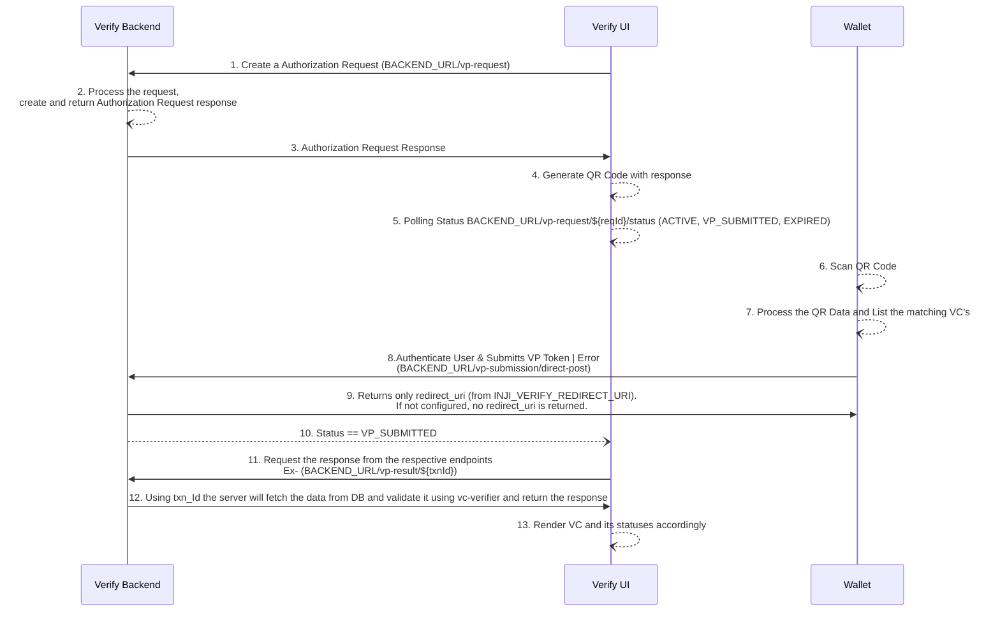

# OpenID4VP - Online Sharing Cross Device Flow

The Inji verify supports OpenID4VP specification draft 21 and this document provides a comprehensive overview of the process of initiating a OpenID4VP sharing flow to
wallets who can create and share the Verifiable Presentation online. It adheres to the OpenID4VP [specification](https://openid.net/specs/openid-4-verifiable-presentations-1_0-21.html) which outlines the standards for
requesting and presenting Verifiable Credentials.

## Specifications supported
- The implementation follows OpenID for Verifiable Presentations - draft 21. [Specification](https://openid.net/specs/openid-4-verifiable-presentations-1_0-21.html).
- Presentation Definition which adheres to the Presentation Exchange 2.0.0 [Specification](https://identity.foundation/presentation-exchange/spec/v2.0.0)
- VC format supported is Ldp Vc as of now.

## API Documentation
The API documentations can be found [here](https://mosip.stoplight.io/docs/inji-verify/branches/main/)

## Functionalities
### Authorization Request Creation:
- Inji Verify can generate a QR code with authorization request which is created and obtained from Inji Verify backend. 
  - Below are the fields we expect in the creation of a new authorization request,
      - client_id
      - **_presentationDefinitionId_** or **_presentationDefinition_** (presentationDefinition - should adhere to the [Specification](https://identity.foundation/presentation-exchange/spec/v2.0.0)
      - transactionId (Optional) - will be generated at server if not provided
  - Inji verify Ui will make a request to backend to create the authorization request and the UI will render this as a QR code for the wallet to scan.

###  Authorization Request Status:
- Inji Verify have API to get the current status of an authorization request.
    - The status will be,
      - **_ACTIVE_** - Authorization request is created but nor expired or any VP submission has been received. 
      - **_VP_SUBMITTED_** - VP has been submitted for authorization request.
      - **_EXPIRED_** - No VP submission happened within expiry time and the authorization request expired.
- This API call is a long poll call which will have a one-minute timeout.

###  Verifiable Presentation Submission:
- Inji Verify have API to submit Verifiable Presentation.
- Once the wallet scans the QR code, it generates the VP token and the submission request, which are then posted to the Inji Verify backend.
- If the wallet encounters any error while generating the VP token, it will post the error back to the Inji Verify backend along with an error description.

> **Important Implementation Note:**
> The endpoint can return a **_redirect_uri_** based on the **_INJI_VERIFY_REDIRECT_URI_** configuration.
>
> If **_INJI_VERIFY_REDIRECT_URI_** is blank, no **_redirect_uri_** is returned.
>
> This minimal feature implementation is intended to support integration with specific modules (e.g., wallets and verifier applications). Full implementation, including response_code support, is planned for future releases to ensure complete compliance with the OpenID4VP specification.

###  Submission Result:
- Once the wallet submits the VC, The status will be changed to **_VP_SUBMITTED_**.
- Inji verify UI can fetch the result of the submission through APIs. The result will contain two things.
  - Overall status of submission, either its **_SUCCESS_** or **_FAILED_**
  - List of VC with its own verification status, it can be 
  * **_SUCCESS_** 
  * **_INVALID_** 
  * **_EXPIRED_**
  * **_REVOKED_**
- During the revocation check, any error encountered by the vc_verifier will result in an exception containing a descriptive error message, which the Verify UI will display to the user.

## Sequence Diagram
