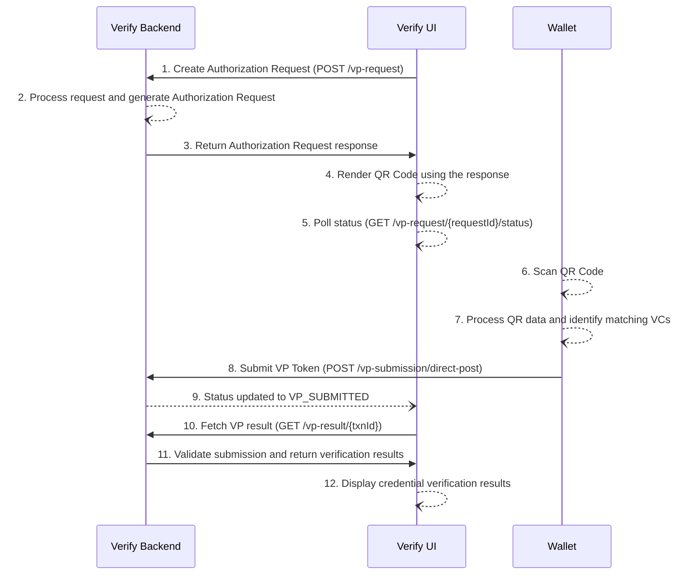

# OpenID4VP – Online Sharing Cross-Device Flow

Inji Verify supports the **OpenID for Verifiable Presentations (OpenID4VP)** draft-21 specification.  
This document explains how Inji Verify initiates and processes a cross-device online Verifiable Presentation (VP) sharing flow.

---

# 1. Specifications Supported

- **OpenID4VP – Draft 21**  
  https://openid.net/specs/openid-4-verifiable-presentations-1_0-21.html
- **Presentation Exchange 2.0.0 (PEX 2.0.0)**  
  https://identity.foundation/presentation-exchange/spec/v2.0.0
- **Supported VC Format**  
  - Linked Data Proof Verifiable Credentials (LDP-VC)

---

# 2. API Documentation

Complete API reference:  
👉 **https://mosip.stoplight.io/docs/inji-verify/branches/main/**

---

# 3. Endpoint Summary

| Purpose | Method | Endpoint |
|--------|--------|----------|
| Create Authorization Request | **POST** | `/vp-request` |
| Get Authorization Request Status | **GET** | `/vp-request/{requestId}/status` |
| Submit VP Token (Direct Post) | **POST** | `/vp-submission/direct-post` |
| Get VP Verification Result | **GET** | `/vp-result/{transactionId}` |

---

# 4. Functionalities

## 4.1 Authorization Request Creation

The verifier (Inji Verify) initiates a VP request containing a Presentation Definition.

### Example Request

```json
POST /vp-request
Content-Type: application/json

{
  "client_id": "inji-verify-ui",
  "presentationDefinitionId": "national-id-pd-001",
  "transactionId": "txn-98465123"
}
```
OR using inline Presentation Definition:

```json
POST /vp-request
Content-Type: application/json

{
  "client_id": "inji-verify-ui",
  "presentationDefinition": {
    "id": "pd-123",
    "input_descriptors": [
      {
        "id": "national-id",
        "name": "National ID",
        "schema": [
          { "uri": "https://example.org/credentials/national-id" }
        ]
      }
    ]
  }
}
```

### Example response

```json
{
  "requestId": "req-87324612",
  "transactionId": "txn-98465123",
  "authorizationRequest": {
    "client_id": "inji-verify-ui",
    "response_type": "vp_token",
    "response_mode": "direct_post",
    "presentation_definition_uri": "https://server/vp/pd/pd-123",
    "nonce": "789123xyz",
    "state": "a1b2c3d4e5"
  },
  "qrPayload": "openid-vp://...?client_id=inji-verify-ui&..."
}
```

## 4.2 Authorization Request Status

The Authorization Request Status API allows Inji Verify UI to determine the current state of a VP Request.
This endpoint is called repeatedly using long polling until the request transitions to a final state.

### Purpose

To fetch the current status of an Authorization Request created during the OpenID4VP flow.

### When UI Calls This

Immediately after generating the VP Request (QR code or redirect-based).
Continues to call every minute (long poll timeout) until:
A VP is submitted (VP_SUBMITTED), or
The request expires (EXPIRED).

### Example Call

```json
GET /vp-request/req-87324612/status
```

### Possible Responses

#### Status: ACTIVE

Authorization request is valid and waiting for VP submission.
- QR has been scanned OR user may still scan.
- No VP has been submitted yet.
- Request has not expired.

```json
{
  "status": "ACTIVE",
  "requestId": "req-87324612",
  "transactionId": "txn-98465123"
}
```

#### Status: VP_SUBMITTED

Wallet has submitted a valid VP Token for this Authorization Request.
- VP token was received via /vp-submission/direct-post.
- Validation is successful.
- UI should now redirect to the verification results page.

```json
{
  "status": "VP_SUBMITTED",
  "requestId": "req-87324612",
  "transactionId": "txn-98465123"
}
```

#### Status: EXPIRED

No VP submission happened within the configured expiry time.
- Request is no longer valid.
- UI should stop polling and display an expiry message.

```json
{
  "status": "EXPIRED",
  "requestId": "req-87324612"
}
```

## 4.3 Verifiable Presentation Submission

### Successful Request

Wallet scans the QR and posts the VP Token along with presentation_submission and state.

### Example Successful Request

```json
POST /vp-submission/direct-post
Content-Type: application/json

{
  "state": "a1b2c3d4e5",
  "vp_token": {
    "vp": {
      "@context": ["https://www.w3.org/2018/credentials/v1"],
      "type": ["VerifiablePresentation"],
      "verifiableCredential": [ /* VC content here */ ]
    }
  },
  "presentation_submission": {
      "id": "ps-123",
      "definition_id": "pd-123",
      "descriptor_map": [
        {
          "id": "national-id",
          "format": "ldp_vp",
          "path": "$.verifiableCredential[0]"
        }
      ]
    }
}
```

### Error Handling

If the wallet cannot create/obtain/submit a VP (user cancels, wallet fails to fetch VC, network error, etc.), the wallet should POST an error object to the same endpoint so the backend and UI can have a recorded reason.

### Example Error Response

```json
{
  "state": "a1b2c3d4e5",
  "errorCode": "USER_CANCELLED",
  "errorDescription": "User rejected the credential share request in the wallet UI."
}

### Example Response

```json
{
  "redirect_uri": "https://inji-verify-ui/callback?txnId=txn-98465123"
}
```

**⚠ Note:** 
```
The response_code parameter is not yet returned.
Full support will be added in future versions.
```

## 4.4 Submission Result

The verifier UI fetches the VP verification result.

### Example Request

```json
GET /vp-result/txn-98465123
```

### Example Response

```json
{
  "transactionId": "txn-98465123",
  "result": "SUCCESS",
  "credentials": [
    {
      "id": "cred-001",
      "type": "NationalIDCredential",
      "status": "VALID"
    }
  ]
}
```

OR in case of invalid submission:

```json
{
  "transactionId": "txn-98465123",
  "result": "INVALID",
  "credentials": [
    {
      "id": "cred-001",
      "type": "NationalIDCredential",
      "status": "INVALID_SIGNATURE"
    }
  ]
}
```

# 5. Sequence Diagram


