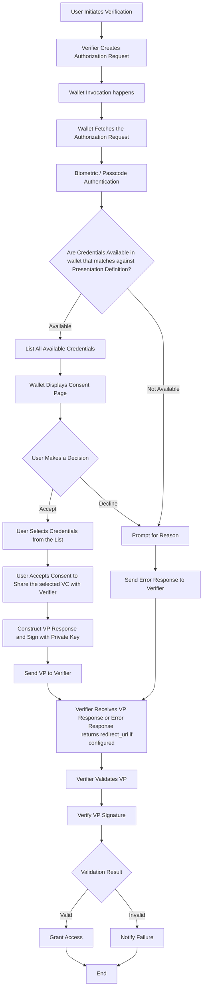

# OpenID4VP - Online Sharing Same Device Flow

## Same Device Flow
### Description of the Flow
The Same Device Flow in the OpenID for Verifiable Presentations enables the interaction between a verifier and a wallet where both the applications are on the same device, Unlike Scanning the QR code from the wallet application manually as we do in cross-device flow

The flow here utilizes the simple redirection to pass the Authorization request and Authorization response between the verifier and the wallet

### Key Steps in the Flow
1. **Initiation**: The flow begins when the user in the Verifier application selects an option to verify their credentials or when the user wishes to present the credentials as Verifiable Credentials from their wallet to the application they are using

2. **Authorization Request**: The Verifier App constructs an authorization request that contains several parameters like
   * **response_type**: Specifies the type of response expected from the authorization server(wallet) for example in our case response_type = vp_token
   * **Client_id**: The unique identifier for the client (Verifier) application making the request
   * **redirect_uri**: This is the URI where the authorization server (Wallet) will send the authorization response and redirect the user back to the verifier(client) application
   * **request_uri**: This is a URL where the verifier application directs the Wallet to retrieve the actual Authorization Request, used when the request object is too large to be transmitted directly, helping to keep the Request Object size smaller.
   * **response_mode**: This parameter tells the wallet that how it should send the vp_token to the verifier application

     | Response Mode         | Description|
     | --------------------- | ----------------------------------------------------------------------------------------------------------------------------------------------------------------------------------------------------------------------------------------------------------------------------------------------------------------------------------------------------------------------------------------------------------------------------------------------------------------------------------------------------------------------------------- |
     | Direct Post (Default) | * Response will be sent to verifier using HTTP post request and response body will be encoded by specifying the content type as “application/x-www-form-urlencoded" <br/> * Here response will be sent to a specific resource (response_uri) which will be controlled by the verifier and verifier will fetch the response (vp_token) from this resource by using transaction-id which is unique to this vp flow. <br/>* Verifier will provide the uri of the resource to wallet by sending response_uri in Authorization request. |
     | Fragment              | Response will be encoded in the Fragment added to the redirect_uri and will be sent to the verifier when redirecting the end-user back to the verifier
   * **response_uri**- if verifier send the response mode as Direct post, then verifier is expecting the response to be sent to some resource which will be under the control of the verifier and verifier will get the response from this response-uri.
   * **presentation_definition** (Required)- It is an JSON object which contains the info about the credentials that are being requested by the verifier.
   * **presentation_definition_uri** - to reduce the size of the request or QR code sometimes the verifier stores the presentation_definition Json object at some resource endpoint and sends that resource uri to wallet and wallet call this endpoint and gets the presentation definition object.
   * **client_id_scheme** - this value used by the Verifier to tell wallet about how it needs to interpret the client identifier provided by the verifier based on the scheme selected.
   * **client_metadata** - Json object which contains the verifier metadata
   * **state** - It contains request-id, and it is a random value generated by verifier cryptographically, and it is used for binding the Authorization request and response.
   * **nonce**- it is a random value generated by verifier cryptographically and used for preventing the replay attacks. Here this random value will be bound to the authorization response so that even if attacker intercepts the VP response, they cannot replay the VP response again.

3. **Request Transmission**: The constructed authorization request is sent directly to the wallet application on the same device. This transmission can occur via a custom URL scheme or domain-bound links, depending on the implementation.
   The Authorization Request can be of by value or by reference
   Then the Wallet app is invoked, and the authorization Request is passed to it

4. **User Consent**: Upon receiving the request, the wallet displays a consent page to the user which has the options to accept or decline the request. 
   
   Once the user accepts to share the credentials to the verifier application wallet proceeds to create a verifiable presentation, if the user declines the request, then the wallet prompts a reason or simply cancel request

5. **Authorization Response**: After the user accepts the request then wallet checks for the credentials which matches as per the presentation definition (which the verifier requested for) and if there are any wallet shows the list to the user allowing them to select, and then it constructs a VP response and signs using its private key.

   * **Response Parameters**:
   The response Parameters may have
     * **vp_token** - JSON string or object which contains either a single VP or array of VPs. Each VC in every VP can be either encoded using base64url or sent as JSON object.
     * **presentation_submission** - It contains mappings between the requested Verifiable Credentials and where to find them within the returned VP Token.

      Or
     * **error** - String to allow the wallet to report errors.
     * **errorDescription** - String which contain human readable description about the error reported by wallet.

      And
     * **other parameters include** - state(**request-id**), code, id_token

6. **Transmission of Authorization Response**: Once the Wallet prepares the VP, Wallet sends it back to verifier application (using redirect URI) based on the response_mode and the response_type specified by the verifier application in the Authorization Request

   > **Important Implementation Note:**
   > The endpoint can return a **_redirect_uri_** based on the **_INJI_VERIFY_REDIRECT_URI_** configuration.
   >
   > If **_INJI_VERIFY_REDIRECT_URI_** is blank, no **_redirect_uri_** is returned.
   >
   > This minimal feature implementation is intended to support integration with specific modules (e.g., wallets and verifier applications). Full implementation, including response_code support, is planned for future releases to ensure complete compliance with the OpenID4VP specification. 

7. **Validation of the Authorization Response**: Upon receiving the Authorization Response from the Wallet, the verifier validates the signature of the Verifiable Presentation (VP) using the wallet’s public key. It also verifies each Verifiable Credential (VC) by checking the issuer’s proof details.

   The final result returned to the Verify UI contains:
   - The overall submission status: SUCCESS or FAILED
   - A list of VCs with their individual verification statuses: SUCCESS, INVALID, EXPIRED, or REVOKED.

   During the revocation check, if the vc_verifier encounters any error, it returns an exception with a descriptive error message, which the Verify UI displays to the user.


Flow Chart:


### Brief on Wallet Invocation
In the Case of the Cross Device flow the wallet Invocation happens manually that is end user opens the Wallet manually and scans the QR code that contains the Authorization request post that wallet flow continuous but in the case of the same device flow the wallet invocation happens in either of the two ways and they are

1. **Custom URL Scheme as an Authorization Endpoint**

2. **Domain-bound Universal Links/App Links as an Authorization Endpoint**


#### Wallet Invocation through Custom URL Scheme
* **Description**: The Verifier can invoke the Inji Wallet app directly using a **custom URL scheme (openid4vp://)**. This mechanism allows the Wallet to be triggered without requiring domain-bound universal links.
The Wallet is configured to recognize the scheme openid4vp:// with the host authorize. When the Verifier sends an authorization request, it redirects the user to a URL using this scheme, triggering the Wallet to open and handle the request.

* **How it works**: The Verifier generates a URL with the custom scheme, which, when clicked, will open the Wallet app on the same device. If the Wallet app is installed, the app will handle the request; otherwise, an error or fallback action is triggered.

```
Example using Custom URL Scheme:
openid4vp://authorize?token=xyz123
```

#### Wallet Invocation through Domain-bound Universal Links/App

* **Description**: This method uses **Universal Links (iOS)** or **App Links (Android)** as the `authorization_endpoint`. Universal Links/App Links are deep links that open the Wallet app directly when the link is clicked. If the app is installed, it will launch; if it’s not installed, the link will fall back to a web-based page or prompt to download the app.

* **How it works**: The Verifier sends a URL associated with a domain. If the Wallet app is installed, the link opens the app directly. If not, the user is directed to a fallback web page.

```
Example using Domain-bound Universal Links/App:
openid4vp://authorize?token=xyz123
```