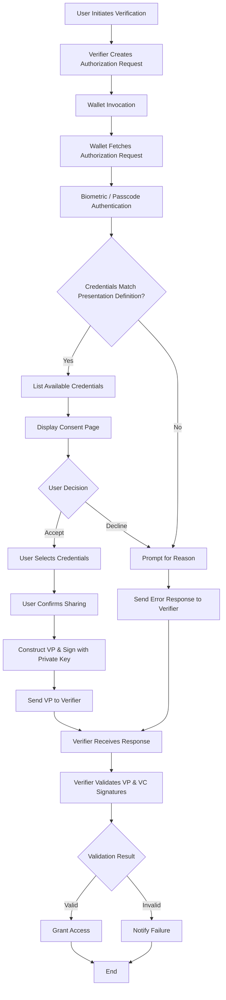

# OpenID4VP - Online Sharing (Same Device Flow)

## Description

The **Same Device Flow** in OpenID for Verifiable Presentations (OpenID4VP) enables interaction between a Verifier and a Wallet when both applications reside on the same device. This contrasts with the Cross-Device flow, where a user manually scans a QR code displayed on a different screen.

This flow utilizes simple redirection (Deep Linking) to pass the Authorization Request and Authorization Response between the Verifier and the Wallet.

## Key Steps in the Flow

### 1. Initiation

   The flow begins when the user selects an option in the Verifier application to verify their credentials, or expresses an intent to present Verifiable Credentials (VCs) from their Wallet to the current application.

### 2. Authorization Request Construction

   The Verifier App constructs an authorization request containing specific parameters:

   * `response_type`: Specifies the type of response expected from the authorization server (Wallet). For example: `response_type=vp_token`.
   * `client_id`: The unique identifier for the client (Verifier) application making the request.
   * `redirect_uri`: The URI where the Wallet will send the authorization response (or error) and redirect the user back to the Verifier application.
   * `request_uri`: A URL where the Verifier directs the Wallet to retrieve the actual Authorization Request Object. This is used when the request object is too large to be transmitted directly via the deep link.
   * `response_mode`: Dictates how the Wallet should send the `vp_token` to the Verifier.

      | Response Mode | Description |
      | :--- | :--- |
      | **Direct Post** (Default) | • The response is sent to the Verifier using an HTTP POST request.<br>• The body is encoded as `application/x-www-form-urlencoded`.<br>• The response is sent to a specific resource (`response_uri`) controlled by the Verifier.<br>• The Verifier fetches the `vp_token` from this resource using a transaction ID unique to this flow. |
      | **Fragment** | • The response is encoded in the URL Fragment of the `redirect_uri`.<br>• The data is passed directly to the Verifier application when the OS redirects the user back to the app. |

   * `response_uri`: Required if `response_mode` is **Direct Post**. This is the endpoint where the Verifier expects the Wallet to POST the response.
   * `presentation_definition` (Required): A JSON object describing the specific credentials (type, schema, trusted issuers) requested by the Verifier.
   * `presentation_definition_uri`: Alternatively, the Verifier can store the `presentation_definition` JSON at a remote URL and provide this URI to the Wallet to reduce the request size.
   * `client_id_scheme`: Tells the Wallet how to interpret the `client_id` provided (e.g., `x509_san_dns`, `did`).
   * `client_metadata`: A JSON object containing metadata about the Verifier (e.g., logo, name).
   * `state`: A random, cryptographically generated value used to bind the Authorization Request to the Response (acts as a request ID).
   * `nonce`: A random, cryptographically generated value used to prevent replay attacks. This value is bound to the response signature.

### 3. Request Transmission

   The constructed authorization request is sent directly to the Wallet application on the same device. This transmission occurs via a **Custom URL Scheme** or **Domain-Bound Links** (Universal/App Links).

   * The Authorization Request can be passed **by value** (embedded in the URL) or **by reference** (via `request_uri`).
   * The Wallet app is invoked, and it parses the authorization request.

### Example Authorization Request

The Deep Link (Transmission) This URL is sent to the device OS to invoke the Wallet. It uses the "By Reference" method (request_uri) to keep the URL length manageable.

### Example URL

```json
openid4vp://authorize?client_id=https%3A%2F%2Fbank-verifier.com&request_uri=https%3A%2F%2Fbank-verifier.com%2Frequest%2F987654
  ```

Or the Request Object (JSON) When the Wallet resolves the request_uri above, it downloads this JSON object. In this example, the Verifier is requesting a "University Degree" credential.

### Example Request 

```json
{
  "client_id": "https://bank-verifier.com",
  "client_id_scheme": "web",
  "response_type": "vp_token",
  "response_mode": "direct_post",
  "response_uri": "https://bank-verifier.com/vp-submission/direct-post",
  "nonce": "n-0S6_WzA2Mj",
  "state": "af0ifjsldkj",
  "presentation_definition": {
    "id": "degree_verification",
    "input_descriptors": [
      {
        "id": "university_degree",
        "name": "University Degree",
        "purpose": "We need to verify your graduation status.",
        "constraints": {
          "fields": [
            {
              "path": ["$.credentialSubject.degree.type"],
              "filter": {
                "type": "string",
                "pattern": "BachelorOfScience"
              }
            }
          ]
        }
      }
    ]
  }
}
```

### 4. User Consent

   Upon receiving the request, the Wallet displays a consent page to the user, offering the option to **Accept** or **Decline**.
   * **Accept:** The Wallet proceeds to create a Verifiable Presentation.
   * **Decline:** The Wallet prompts for a reason or simply cancels the flow.

### 5. Authorization Response Generation

   If the user accepts, the Wallet queries its storage for credentials matching the `presentation_definition`. If matches are found, the user selects the specific VC(s) to share. The Wallet then constructs a VP Response and signs it using its private key.

   **Response Parameters:**
   * `vp_token`: A JSON string or object containing a single VP or an array of VPs. Each VC within the VP can be a Base64URL encoded string or a JSON object.
   * `presentation_submission`: A JSON object mapping the requested VCs to their location within the `vp_token`.
   * `state`: The unique request ID received in step 2.
   * `id_token` / `code`: Additional parameters depending on the specific flow configuration.

### 6. Transmission of Authorization Response

   The Wallet submits the VP to the Verifier application by invoking the VP Submission endpoint, based on the `response_mode` and `response_type`.

   > **Important Implementation Note:**
   > The VP submission endpoint (`/vp-submission/direct-post`) intentionally returns **only a `redirect_uri`** without including a `response_code` parameter.
   >
   > This minimal feature implementation is provided to enable integration with specific modules (wallets, verifier applications). Full `response_code` support is tracked for future releases to ensure complete compliance with the OpenID4VP specification.

### Example Authorization Response

```json
POST /vp-submission/direct-post
Content-Type: application/json

{
  "state": "a1b2c3d4e5",
  "vp_token": {
    "vp": {
      "@context": ["https://www.w3.org/2018/credentials/v1"],
      "type": ["VerifiablePresentation"],
      "verifiableCredential": [ /* VC content here */ ]
    }
  },
  "presentation_submission": {
      "id": "ps-123",
      "definition_id": "pd-123",
      "descriptor_map": [
        {
          "id": "national-id",
          "format": "ldp_vp",
          "path": "$.verifiableCredential[0]"
        }
      ]
    }
}
```

### 7. Validation of the Authorization Response

   Upon receiving the Authorization Response, the Verifier:
   1.  Validates the signature of the Verifiable Presentation (VP) using the Wallet's public key.
   2.  Validates the signature of each contained Verifiable Credential (VC) using the Issuer's public key.
   
   **Result:**
   * **Success:** The Verifier grants access or approves the transaction.
   * **Failure:** The Verifier notifies the user that verification failed.

### Flow Chart



### Brief on Wallet Invocation

In the Case of the Cross Device flow the wallet Invocation happens manually that is end user opens the Wallet manually and scans the QR code that contains the Authorization request post that wallet flow continuous but in the case of the same device flow the wallet invocation happens in either of the two ways and they are

### 1. Custom URL Scheme as an Authorization Endpoint

* **Description**: The Verifier can invoke the Inji Wallet app directly using a **custom URL scheme (openid4vp://)**. This mechanism allows the Wallet to be triggered without requiring domain-bound universal links.
The Wallet is configured to recognize the scheme openid4vp:// with the host authorize. When the Verifier sends an authorization request, it redirects the user to a URL using this scheme, triggering the Wallet to open and handle the request.

* **How it works**: The Verifier generates a URL with the custom scheme, which, when clicked, will open the Wallet app on the same device. If the Wallet app is installed, the app will handle the request; otherwise, an error or fallback action is triggered.

```
Example using Custom URL Scheme:
openid4vp://authorize?token=xyz123
```

### 2. Domain-bound Universal Links/App Links as an Authorization Endpoint

* **Description**: This method uses **Universal Links (iOS)** or **App Links (Android)** as the `authorization_endpoint`. Universal Links/App Links are deep links that open the Wallet app directly when the link is clicked. If the app is installed, it will launch; if it’s not installed, the link will fall back to a web-based page or prompt to download the app.

* **How it works**: The Verifier sends a URL associated with a domain. If the Wallet app is installed, the link opens the app directly. If not, the user is directed to a fallback web page.

```
Example using Domain-bound Universal Links/App:
openid4vp://authorize?token=xyz123
```
