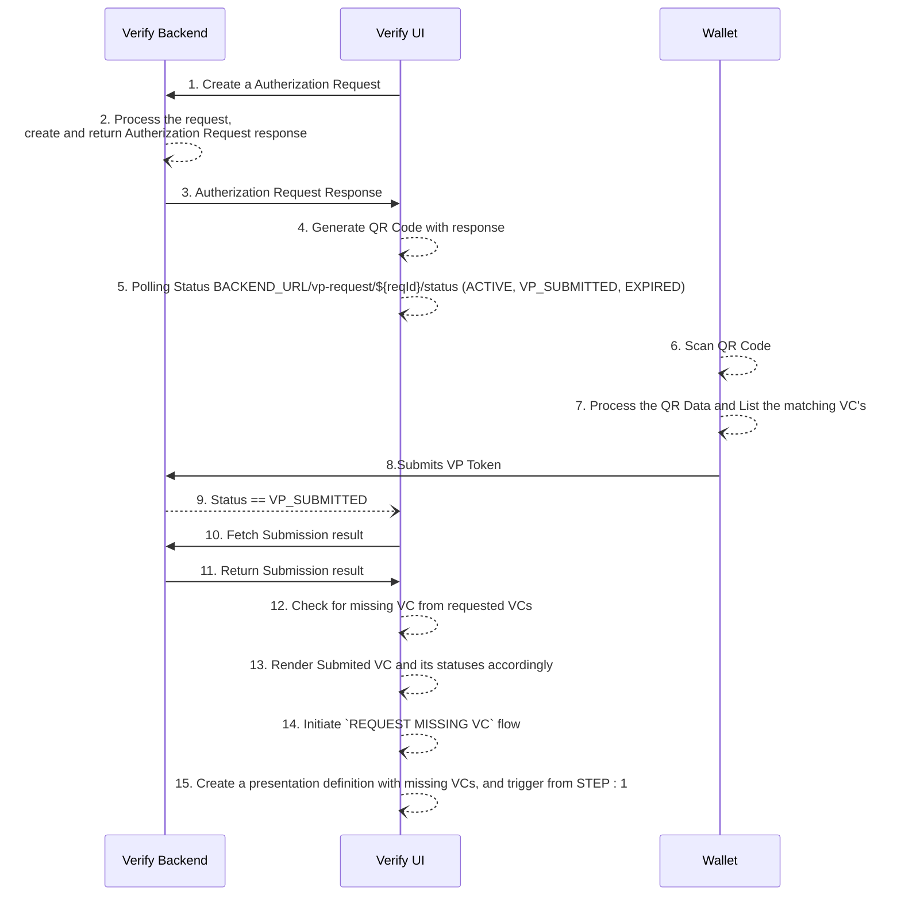

# OpenID4VP - Partial Sharing Of Verifiable Credential

- Inji Verify will generate a QR code with authorization request for selected VCs, which is created and obtained from Inji Verify backend. 
- Inji verify Ui will make a request to backend to create the authorization request and the UI will render this as a QR code for the wallet to scan.
- Once the wallet scans the QR code, wallet generates the VP token and submission request. This will be posted to the Inji verify backend.
- Once the wallet submits the VC, The status will be changed to **_VP_SUBMITTED_**.
- Inji verify UI can fetch the result of the submission through APIs. The result will contain two things.
  - Overall status of submission, either its **_SUCCESS_** or**_INVALID_**
  - List of VC with its own verification status.
- Inji verify UI checks the result of the submission and matches against the selected claims. If any requested VC is missing user is given option to request missing VCs
- Upon initiating same flow the missing VCs will be re requested

## Sequence Diagram
