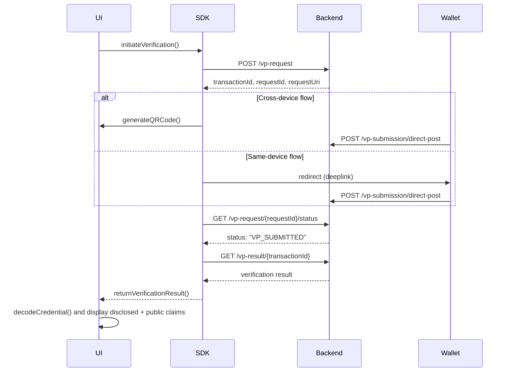

# SD-JWT Support in Inji Verify

## 🔍 Overview

Inji Verify now supports **Selective Disclosure JSON Web Tokens (SD-JWTs)** as a credential format — specifically, the IETF-defined SD-JWT (vc+sd-jwt) format.  
When Verifiable Credentials (VCs) are returned as SD-JWT strings, the UI decodes and renders them using the `@sd-jwt/decode` library.

This document explains:
- How SD-JWT fits into the existing OpenID4VP and verification flows
- How decoding is handled in the UI
- Error handling and integration guidelines

---

## 🧩 What is SD-JWT?

**SD-JWT (Selective Disclosure JWT)** is a JWT-based credential format that allows the holder to disclose only parts of the credential while keeping the rest hidden.  
It enables privacy-preserving presentations without revealing undisclosed claims.

Key characteristics:
- VCs are encoded as **compact SD-JWT strings (vc+sd-jwt)** 
- Public and disclosed claims are included in the Verifiable Presentation
- Undisclosed claims remain hidden while maintaining cryptographic binding
- Signature integrity is maintained

---

## 🏗 How SD-JWT Fits Into Inji Verify

When a wallet submits a Verifiable Presentation (VP), the embedded VC may be either:
- A JSON object, or
- An **SD-JWT string**

The backend verifies the VP and returns a `vpResult` to the UI.  
If the VC is a string, the UI decodes it using the SD-JWT library before displaying.

### Flow Summary

1. Wallet constructs VP  
2. Backend validates and returns `vpResult`  
3. UI checks if `vc` is a string  
4. If yes → decode using `@sd-jwt/decode`  
5. Display the claims and verification status

---

## 🧰 SDK / UI Integration

### ✅ Install Dependency

```bash
npm install @sd-jwt/decode@0.8.1-next.0
```

# 🔄 Verification Flow (SDK ↔ Backend Sequence)

This section describes the interaction sequence between the **Inji Verify SDK** and the **Verifier backend APIs** during the Verifiable Presentation (VP) verification process.

---

## 🧩 Step 1: Create Verifiable Presentation (VP) Request

**Purpose:** The verifier initiates the verification process by creating a VP request through the SDK.

| Sequence | Description | SDK / Method | Backend API |
|-----------|--------------|---------------|--------------|
| 1 | SDK sends a request to the backend to create a new VP request with presentation definition | `createVPRequest()` | `POST /vp-request` |
| 2 | Backend generates and responds with VP request details including:<br>`transactionId`, `requestId`, `expiresAt`, and `requestUri` | – | **Response example:**<br>```{  "transactionId": "txn_id", "requestId": "req_id", "expiresAt": 1761814010329, "requestUri": "url"}``` |
| 3 | SDK uses the response to generate QrCode or redirect to wallet : | – | – |
| &nbsp;&nbsp;• **Cross-device flow** → SDK generates a QR code for wallet to scan | `generateQRCode()` | – |
| &nbsp;&nbsp;• **Same-device flow** → SDK redirects to wallet using deep link | `redirect to supported wallet application` | – |

---

## 📤 Step 2: Wallet Submits the Verifiable Presentation

**Purpose:** Wallet submits Verifiable Presentation (VP) with matching credentials.

| Sequence | Description | SDK / Method | Backend API |
|-----------|--------------|---------------|--------------|
| 4 | Wallet scans the QR code or receives the deep link, prepares VP submission | – | – |
| 5 | Wallet submits the VP token (JWT / SD-JWT) and presentation submission to backend | – | `POST /vp-submission/direct-post` |
| 6 | SDK starts polling to track the VP request status | `fetchVPStatus()` | `GET /vp-request/{requestId}/status` |

---

## ✅ Step 3: Verification Result Retrieval

**Purpose:** SDK fetches verification result once the VP is submitted and verified.

| Sequence | Description | SDK / Method | Backend API |
|-----------|--------------|---------------|--------------|
| 7 | Backend verifies the VP (cryptographic validation, issuer verification, schema validation, etc.) | – | *`verify using vc-verifier`* |
| 8 | When backend marks status as `VP_SUBMITTED`, SDK fetches the verification result | `fetchVPResult()` | `GET /vp-result/{transactionId}` |
| 9 | SDK passes verification result to Verifier UI | `returnVerificationResult()` | – |
| 10 | Verifier UI decodes the credential using `@sd-jwt/decode` (if the credential is a compact SD-JWT string) and displays **public + disclosed claims** | `decodeCredential()` | – |

---

## 🧭 Sequence Diagram


