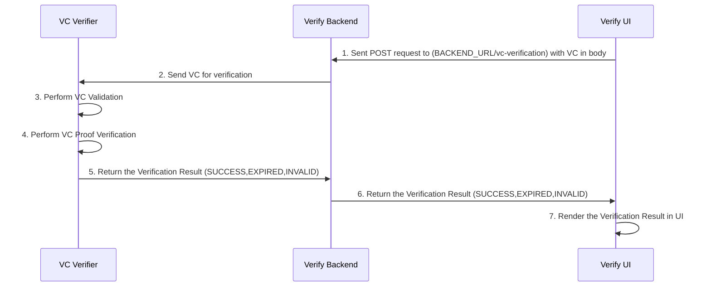

# Server Side Verifiable Credential Proof Verification

The Inji verify supports Verifiable Credential Proof Verification. This feature is available as an [API](https://mosip.stoplight.io/docs/inji-verify/branches/main/1r4yxmahkmbm9-get-the-submitted-vc-verified) in backend service.

The API takes the Verifiable Credential in body and performs a proof verifications and some validations returns the verification result as,

- **_SUCCESS_**
- **_INVALID_**
- **_EXPIRED_**

Inji Verify uses [vc-verifier](https://github.com/mosip/vc-verifier/tree/master/vc-verifier/kotlin) library for Verifiable Credential Proof Verification.

### Steps in Server Side Verification

Below is the process of verifying a Verifiable Credential (VC) using a backend service. It involves three components: **VC Verifier**, **Verify Backend**, and **Verify UI**. Here's a breakdown of the steps:

**1. Sending VC for Verification:**

* The **Verify UI** initiates the process by sending a POST request to the **Verify Backend** at the endpoint `BACKEND_URL/vc-verification`. The Verifiable Credential (VC) that needs to be verified is included in the request body.

**2. Forwarding VC to Verifier:**

* The **Verify Backend** receives the POST request and forwards the VC to the **VC Verifier**. This step likely involves preparing the VC data for the verifier's processing.

**3. Performing VC Validation:**

* The **VC Verifier** receives the VC and performs validation checks. This might include verifying the VC's signature, checking its issuer, and ensuring it adheres to the relevant VC data model.

**4. Performing VC Proof Verification:**

* Following the validation, the **VC Verifier** performs proof verification. This step typically involves verifying cryptographic proofs associated with the VC to ensure its integrity and authenticity.

**5. Returning Verification Result:**

* The **VC Verifier** completes the verification process and returns the verification result to the **Verify Backend**. The result can be one of several states: `SUCCESS`, `EXPIRED`, or `INVALID`.

**6. Returning Verification Result to UI:**

* The **Verify Backend** receives the verification result from the **VC Verifier** and forwards it to the **Verify UI**.

**7. Rendering Verification Result in UI:**

* The **Verify UI** receives the verification result and renders it to the user. This could involve displaying a success message if the VC is valid, or an error message indicating why the VC failed verification (e.g., expired or invalid).

**In summary, this diagram illustrates a simplified workflow for verifying a Verifiable Credential. The Verify UI sends the VC to the backend, which in turn delegates the actual verification to a dedicated VC Verifier. The Verifier performs validation and proof verification, returning a result that is then displayed to the user through the UI.**

## Sequence Diagram

