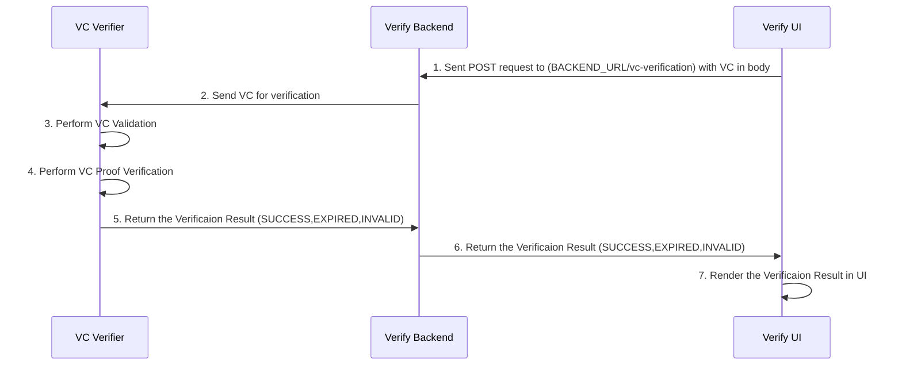

# Verifiable Credential Proof Verification

The Inji verify supports Verifiable Credential Proof Verification. This feature is available as an [API](https://mosip.stoplight.io/docs/inji-verify/branches/main/1r4yxmahkmbm9-get-the-submitted-vc-verified) in backend service.

The API takes the Verifiable Credential in body and performs a proof verifications and some validations returns the verification result as,

- **_SUCCESS_**
- **_INVALID_**
- **_EXPIRED_**

Inji Verify uses [vc-verifier](https://github.com/mosip/vc-verifier/tree/master/vc-verifier/kotlin) library for Verifiable Credential Proof Verification.

## Sequence Diagram

